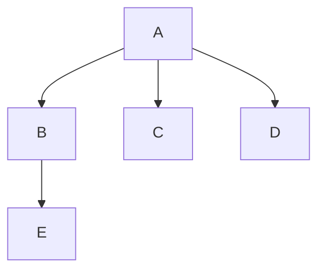
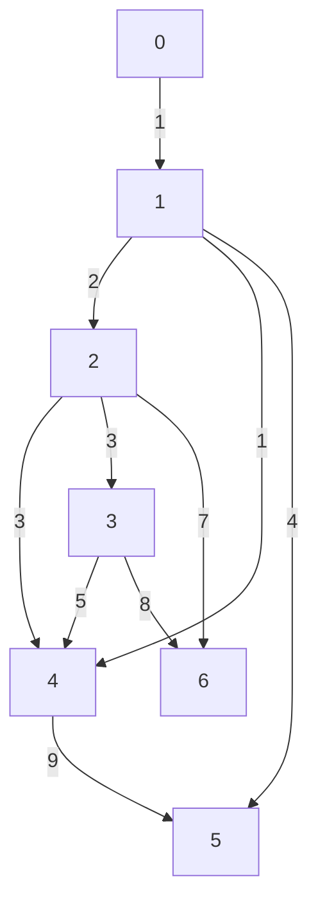
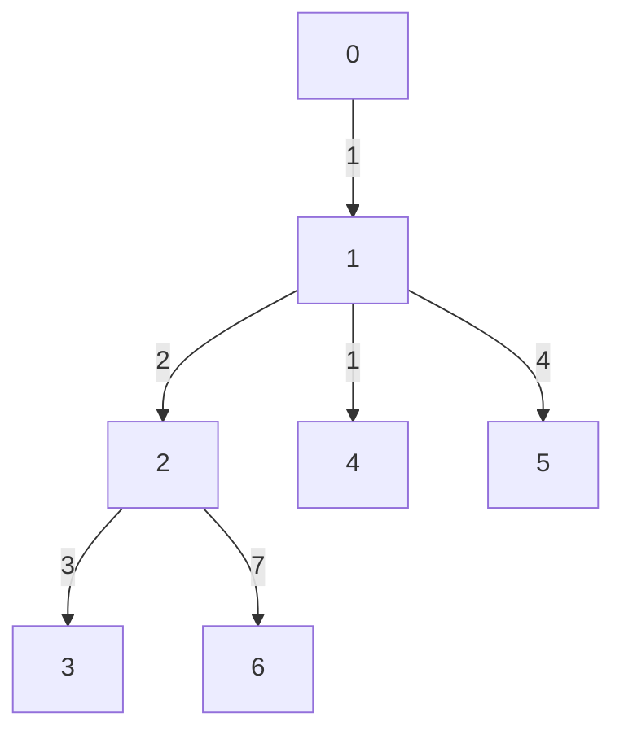

# Graphs_basics
Let's start with BFS and DFS traversal of a graph. 


- BFS Traversal: A B C D E
- DFS Traversal: A B E C D

## BFS Traversal

- Using Queue
- Intuition : BFS is analogous to level order traversal. 
```cpp
void bfsOfGraph(int node, vector<int> adj[], int vis[], vector<int> &ans) {
        vis[node] = 1;
        queue<int> q;
        q.push(node);
        while(!q.empty()) {
            int node = q.front();
            q.pop();
            ans.push_back(node);
            for(auto it : adj[node]) {
                if(!vis[it]) {
                    vis[it] = 1;
                    q.push(it);
                }
            }
        }
    }
    
    vector<int> BFS(int V, vector<int> adj[])
    {
        int vis[V] = {0};
        vector<int> ans;
        for(int i=0;i<V;i++)
        {
            if(!vis[i])                     //Even if the bfsOfGraph finishes for one component, the loop will continue till V, thus providing a traversal for another component as well.
                bfsOfGraph(i,adj,vis,ans);  
        }
        return ans;
    }
```

- Time Complexity: O(N) + O(2E) //2E because the graph is undirected
- The BFS always works for the disconnected components as well.


## DFS Traversal
- Using: Recursion
- Intuition: Continous traversal from one node's adjacency node to next adjacency node's adjacency node and so on. 

```cpp
void dfs(int node, vector<int> adj[], int vis[], vector<int> &ls) {
        vis[node] = 1;
        ls.push_back(node);
        for(auto it : adj[node]) {
            if(!vis[it]) {
                dfs(it, adj, vis, ls);
            }
        }
    }
    vector<int> dfsOfGraph(int V, vector<int> adj[]) {
        int vis[V] = {0};
        int start = 0;
        vector<int> ls;
        for(int i=0;i<V;i++)
        {
            if(!vis[i])
                dfs(i,adj,vis,ls);
        }
        return ls;
    }
```
- Time Complexity: For an undirected graph, O(N) + O(2E), For a directed graph, O(N) + O(E), Because for every node we are calling the recursive function once, the time taken is O(N) and 2E is for total degrees as we traverse for all adjacent nodes.
- Space Complexity: O(3N) //Queue, vis array and dfs stack space.
- Works for disconnected graphs as well.


## Code using the concept of OOPs
```cpp
#include <bits/stdc++.h>
using namespace std;

class Solution {
private:
    void dfs(int node, vector<int> adj[], int vis[], vector<int> &ls) {
        vis[node] = 1;
        ls.push_back(node);
        for(auto it : adj[node]) {
            if(!vis[it]) {
                dfs(it, adj, vis, ls);
            }
        }
    }
    void bfsOfGraph(int node, vector<int> adj[], int vis[], vector<int> &ans) {

        vis[node] = 1;
        queue<int> q;
        q.push(node);
        //vector<int> ans;
        while(!q.empty()) {
            int node = q.front();
            q.pop();
            ans.push_back(node);
            for(auto it : adj[node]) {
                if(!vis[it]) {
                    vis[it] = 1;
                    q.push(it);
                }
            }
        }
        //return ans;
    }
public:

    vector<int> BFS(int V, vector<int> adj[])
    {
        int vis[V] = {0};
        vector<int> ans;
        for(int i=0;i<V;i++)
        {
            if(!vis[i])
                bfsOfGraph(i,adj,vis,ans);
        }
        return ans;
    }

    vector<int> dfsOfGraph(int V, vector<int> adj[]) {
        int vis[V] = {0};
        int start = 0;
        vector<int> ls;
        for(int i=0;i<V;i++)
        {
            if(!vis[i])
                dfs(i,adj,vis,ls);
        }
        return ls;
    }
};

void addEdge(vector <int> adj[], int u, int v) {
    adj[u].push_back(v);
    adj[v].push_back(u);
}

void printAns(vector <int> &ans) {
    for (int i = 0; i < ans.size(); i++) {
        cout << ans[i] << " ";
    }
}

int main()
{
    vector <int> adj[6];

    addEdge(adj, 0, 2);
    addEdge(adj, 2, 4);
    addEdge(adj, 0, 1);
    addEdge(adj, 0, 3);

    Solution obj;
    vector <int> ans1 = obj.BFS(5, adj);
    vector <int> ans2 = obj.dfsOfGraph(5, adj);
    cout<<"\n BFS Traversal is\n";
    printAns(ans1);
    cout<<endl;
    cout<<"\n DFS Traversal is\n";
    printAns(ans2);

    return 0;
}
```

# Prims's Algorithm


- Intuition: Start with the minimum cost wala edges 
- Therefore, DS used: Min heap which automatically works with minimum of all edges.

Prim's algorithm actually works on the fact that choose the minimum most edges and see if the tree is spanned or not.
So, it's a GREEDY Algorithm.

```cpp
#include<bits/stdc++.h>
using namespace std;
typedef pair<int, int> iPair;


void addEdge(vector <pair<int, int> > adj[], int u,
                                     int v, int wt)
{
    adj[u].push_back(make_pair(v, wt));
    adj[v].push_back(make_pair(u, wt));
}


void primMST(int V,vector<iPair> adj[])
{
    priority_queue<iPair,vector<iPair>,greater<iPair>> pq;
    vector<int> vis(V,0);
    pq.push({0,0});
    int sum =0;
    while(!pq.empty())
        {

            auto it = pq.top();
            pq.pop();
            int node = it.second;
            int wt = it.first;

            if(vis[node]==1)continue;
            vis[node] =1;
            sum+=wt;
            for(auto it: adj[node])
            {
                int adjnode = it.first;
                int adjwt = it.second;
                if(!vis[adjnode])
                pq.push({adjwt,adjnode});
            }
        }
    cout<<"The sum is"<<sum;
}

int main()
{
    int V = 7;
    vector<iPair > adj[V];
    addEdge(adj, 0, 1, 1);
    addEdge(adj, 1, 2, 2);
    addEdge(adj, 2, 3, 3);
    addEdge(adj, 1, 4, 1);
    addEdge(adj, 1, 5, 4);
    addEdge(adj, 2, 4, 3);
    addEdge(adj, 2, 6, 7);
    addEdge(adj, 3, 4, 5);
    addEdge(adj, 3, 6, 8);
    addEdge(adj, 4, 5, 9);


    primMST(V,adj);

    return 0;
}
```
-Time Complexity: O(ElogE) , where E is number of edges
-Space Complexity: O(E) //For priority queue

Graph used:



MST formed



# Dijkistra Algorithm

- Single source multiple destination algorithm
- BFS Algorithm
- Single source to various destination in shortest possible paths

### Way 1: Priority Queue (since minimum distance is there, prioritize the minimum weights, ---> Greedy Approach)

```cpp
#include<bits/stdc++.h>
using namespace std;
typedef pair<int, int> iPair;

void addEdge(vector <pair<int, int> > adj[], int u,
                                     int v, int wt)
{
    adj[u].push_back(make_pair(v, wt));
    adj[v].push_back(make_pair(u, wt));
}

void dijkistra(int V, vector<iPair> adj[], int source)
{
    priority_queue<iPair,vector<iPair>,greater<iPair>> pq;
    vector<int> dist(V,INT_MAX);

    dist[source] = 0;
    pq.push({0,source});

    while(!pq.empty())
    {
        int dis = pq.top().first;
        int node = pq.top().second;
        pq.pop();

        for(auto it: adj[node])
        {
            int edgeweight = it.second;
            int adjnode = it.first;
            if(dis+edgeweight < dist[adjnode])
            {
                dist[adjnode] = dis + edgeweight;
                pq.push({dist[adjnode],adjnode});
            }
        }
    }

    for(int i=0;i<dist.size();i++)
        cout<<"The distance of node"<<i<<"from"<<source<<"is"<<dist[i]<<endl;
}

int main()
{
    int V = 7;
    vector<iPair > adj[V];
    addEdge(adj, 0, 1, 1);
    addEdge(adj, 1, 2, 2);
    addEdge(adj, 2, 3, 3);
    addEdge(adj, 1, 4, 1);
    addEdge(adj, 1, 5, 4);
    addEdge(adj, 2, 4, 3);
    addEdge(adj, 2, 6, 7);
    addEdge(adj, 3, 4, 5);
    addEdge(adj, 3, 6, 8);
    addEdge(adj, 4, 5, 9);

    dijkistra(V,adj,0);
    return 0;
}
```

### Way 2: Set (since minimum distance is there, prioritize the minimum weights, ---> Greedy Approach)

```cpp
void dijkistra_using_set(int V, vector<iPair> adj[], int source)
{
    set<iPair> s;
    vector<int> distance(V,INT_MAX);

    s.insert({0,source});
    distance[source]=0;

    while(!s.empty())
    {
        auto it = *(s.begin());
        int node = it.second;
        int dis = it.first;
        s.erase(it);


        for(auto it: adj[node])
        {
            int adjnode = it.first;
            int adjweight = it.second;
            if(dis+adjweight<distance[adjnode])
            {
                if(distance[adjnode]!=INT_MAX)
                {
                    s.erase({distance[adjnode],adjnode});
                }
                distance[adjnode] = dis + adjweight;
                s.insert({distance[adjnode],adjnode});
            }
        }
    }

    for(int i=0;i<distance.size();i++)
        cout<<"The distance of node"<<i<<"from"<<source<<"is"<<distance[i]<<endl;

}
```

